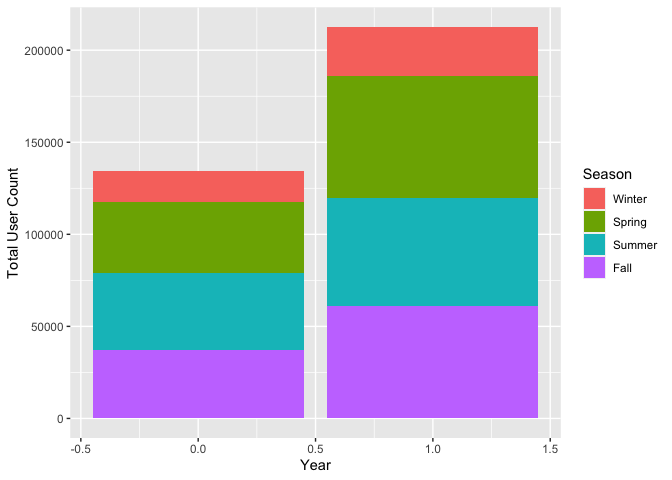
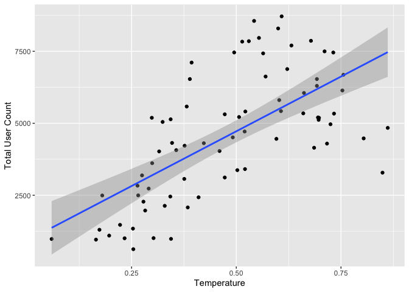
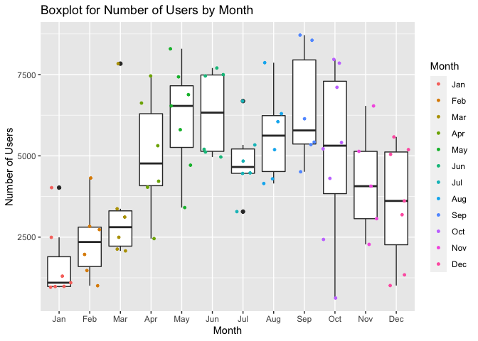
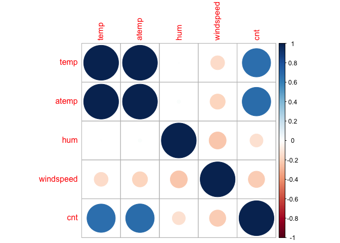
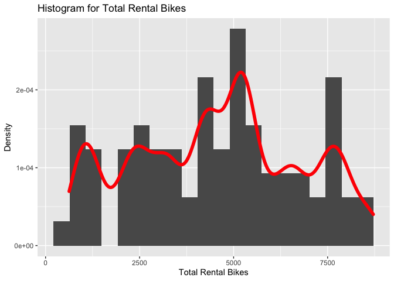
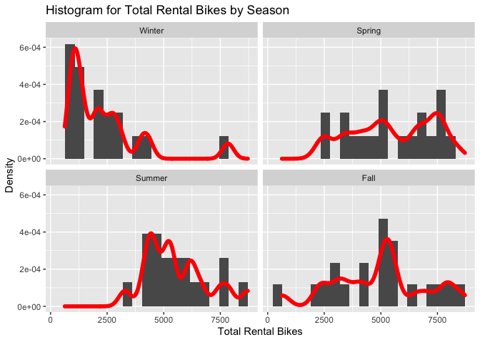

Project 2
================
Nermin Bibic, Xingli Ma
July 8, 2021

-   [Introduction](#introduction)
-   [Data Exploration Analysis](#data-exploration-analysis)
    -   [Read Data and Split the Data into Training and Testing
        Sets](#read-data-and-split-the-data-into-training-and-testing-sets)
    -   [Numerical summaries](#numerical-summaries)
    -   [Graphical summaries](#graphical-summaries)
-   [Modeling, Prediction, and
    Selection](#modeling-prediction-and-selection)
    -   [Linear Regression Models on Training
        Dataset](#linear-regression-models-on-training-dataset)
    -   [Two Ensemble Models on Training
        Dataset](#two-ensemble-models-on-training-dataset)
    -   [Model Selection](#model-selection)

The following R packages are required to run the code to create this
gitbub page.

``` r
require(rmarkdown)
require(knitr)
require(tidyverse)
require(dplyr)
require(ggplot2)
require(caret)
require(DT)
require(corrplot)
```

## Introduction

The purpose of this project is to create predictive models and automate
Markdown reports. The day.csv file from the Bike Sharing Data Set was
downloaded from the [UCI Machine Learning Repository
website](https://archive.ics.uci.edu/ml/datasets/Bike+Sharing+Dataset).
The day.csv file includes 16 variables: instant, dteday, season, yr,
mnth, holiday, weekday, workingday, weathersit, temp, atemp, hum,
windspeed, casual, registered, cnt. Detailed descriptions on these
variables can be found from the [data
website](https://archive.ics.uci.edu/ml/datasets/Bike+Sharing+Dataset).
In our predictive models, we use cnt as the response variable, other
variables as predictors, such as season, yr, mnth, holiday, weekday,
workingday, weathersit, temp, atemp, hum, windspeed. First, we filtered
the data set by each day of the week and then split the day data into
training and testing sets (7:3). Then, we did numerical and graphical
summaries of the training data set. Then, we trained four predictive
models on the training data set, and tested all four models on the
testing set. We compared and selected the best model based on the
smallest Root Mean Square Error (RMSE) value, selecting the model with
the smallest error. Finally, we automated the whole analysis processes
to produce a report for the number of bike users for each day of the
week.

## Data Exploration Analysis

### Read Data and Split the Data into Training and Testing Sets

``` r
# Read and clean data
dayData <- read_csv("day.csv")
dayData <- filter(dayData, weekday == params$day)
dayData <- select(dayData, -c(instant, weekday))
dayData$dteday = as.Date(dayData$dteday, format = "%Y-%m-%d")
# Convert categorical variables to factors
# For categorical variables with 0-1 binary, we don't need to convert to factors.
cols <- c("season", "mnth", "weathersit")
dayData[cols] <- lapply(dayData[cols], factor)
# Split data to train and test sets
set.seed(1)
dayIndex <- createDataPartition(dayData$cnt, p = 0.7, list = FALSE)
dayTrain <- dayData[dayIndex, ]
dayTest <- dayData[-dayIndex, ]
```

### Numerical summaries

#### Overall Summary on Training Dataset

Here, we display a numerical summary (minimum, maximum, 1st quartile,
3rd quartile, median, and mean) for all of the quantitative variables of
the dataset.

``` r
# Display the training data set
kable(summary(select(dayTrain, c(temp, atemp, hum, windspeed, casual,
                                 registered, cnt))))
```

|     | temp            | atemp           | hum            | windspeed      | casual         | registered   | cnt          |
|:----|:----------------|:----------------|:---------------|:---------------|:---------------|:-------------|:-------------|
|     | Min. :0.05913   | Min. :0.07907   | Min. :0.3792   | Min. :0.0454   | Min. : 57.0    | Min. : 570   | Min. : 627   |
|     | 1st Qu.:0.32208 | 1st Qu.:0.32527 | 1st Qu.:0.5032 | 1st Qu.:0.1309 | 1st Qu.: 719.5 | 1st Qu.:2107 | 1st Qu.:2807 |
|     | Median :0.49333 | Median :0.48262 | Median :0.6279 | Median :0.1788 | Median :1455.0 | Median :3184 | Median :4612 |
|     | Mean :0.47943   | Mean :0.46019   | Mean :0.6335   | Mean :0.1833   | Mean :1477.7   | Mean :3087   | Mean :4565   |
|     | 3rd Qu.:0.63875 | 3rd Qu.:0.59802 | 3rd Qu.:0.7531 | 3rd Qu.:0.2239 | 3rd Qu.:2238.0 | 3rd Qu.:4228 | 3rd Qu.:6180 |
|     | Max. :0.86167   | Max. :0.80491   | Max. :0.9292   | Max. :0.4216   | Max. :3410.0   | Max. :5966   | Max. :8714   |

#### Comparing Number of Bike Users in Different Scenarios

First, we compared summary statistics of number of users by whether day
is workingday or not.

``` r
# Renaming factor levels
dayTrainCopy <- dayTrain
dayTrainCopy$workingday <- as.factor(dayTrainCopy$workingday)
levels(dayTrainCopy$workingday) <- c("neither weekend nor holiday", "weekend or holiday")
tapply(X=dayTrainCopy$cnt, INDEX=dayTrainCopy$workingday, summary)
```

    ## $`neither weekend nor holiday`
    ##    Min. 1st Qu.  Median    Mean 3rd Qu.    Max. 
    ##     627    2807    4612    4565    6180    8714 
    ## 
    ## $`weekend or holiday`
    ## NULL

Second, we compared number of users by weather conditions.

``` r
dayTrainCopy <- dayTrain
levels(dayTrainCopy$weathersit) <- list(
  "Clear, Few clouds, Partly cloudy" = 1,
  "Mist + Cloudy, Mist + Broken clouds, Mist + Few clouds, Mist" = 2,
  "Light Snow, Light Rain + Thunderstorm + Scattered clouds, Light Rain + Scattered clouds" = 3
  )
tapply(X=dayTrainCopy$cnt, INDEX=dayTrainCopy$weathersit, summary)
```

    ## $`Clear, Few clouds, Partly cloudy`
    ##    Min. 1st Qu.  Median    Mean 3rd Qu.    Max. 
    ##     981    3172    5083    4918    6639    8714 
    ## 
    ## $`Mist + Cloudy, Mist + Broken clouds, Mist + Few clouds, Mist`
    ##    Min. 1st Qu.  Median    Mean 3rd Qu.    Max. 
    ##     959    2436    4185    4068    5542    7852 
    ## 
    ## $`Light Snow, Light Rain + Thunderstorm + Scattered clouds, Light Rain + Scattered clouds`
    ##    Min. 1st Qu.  Median    Mean 3rd Qu.    Max. 
    ##     627    1585    2543    2543    3501    4459

#### Contingency Tables on Catogorical Variables

Ranges are created for the number of bike users in this contingency
table. This allows us to see how many users there were for each season
based on the ranges created: 0-2000, 2001-4000, 4001-6000, and over
6000. This will show us which season has the most bike users based on
which range they fall mostly on.

``` r
# Contingency table comparing number of users by season
dayTrainCopy <- dayTrain
dayTrainCopy$cntRange <- cut(dayTrainCopy$cnt, c(0, 2000, 4000, 6000))
levels(dayTrainCopy$cntRange) = c("<2000", "2001-4000", "4001-6000", ">6000")

levels(dayTrainCopy$season) <- list("Winter" = 1,
                                    "Spring" = 2,
                                    "Summer" = 3,
                                    "Fall" = 4)

twoWayTab <- table(dayTrainCopy$season,
                   dayTrainCopy$cntRange)
# Comparing Number of Users by Season
kable(twoWayTab, caption = 'Season and Total Number of Users')
```

|        | &lt;2000 | 2001-4000 | 4001-6000 | &gt;6000 |
|:-------|---------:|----------:|----------:|---------:|
| Winter |       10 |         6 |         2 |        0 |
| Spring |        0 |         4 |         7 |        0 |
| Summer |        0 |         1 |        10 |        0 |
| Fall   |        1 |         5 |         9 |        0 |

Season and Total Number of Users

#### Numerical Summaries of Registered and Casual User Counts By Year

The summary statistics for 2011 and 2012 user counts are grouped below
separately. Summary statistics for Registered, Casual, and Total Users
can be compared between the years for this day. The difference in the
median number of total users between the two tables is useful to measure
how many more or less there were users overall between the years.

``` r
# Subset by columns we want to analyze
userCountStats <- dayTrain[ , c("casual", "registered", "cnt", "yr")]
colnames(userCountStats) <- c("Casual Users", "Registered Users", "Total Users", "Year")
# Function for summary statistics for casual and registered user counts
userCountsFiltered <- filter(userCountStats, Year == 0)[, -4]
kable(do.call(cbind, lapply(userCountsFiltered, summary, digits = 3)),
      caption = "Summary of 2011")
```

|         | Casual Users | Registered Users | Total Users |
|:--------|-------------:|-----------------:|------------:|
| Min.    |           57 |              570 |         627 |
| 1st Qu. |          491 |             1480 |        2100 |
| Median  |         1280 |             2650 |        3610 |
| Mean    |         1130 |             2310 |        3440 |
| 3rd Qu. |         1740 |             3210 |        5040 |
| Max.    |         2260 |             3650 |        5800 |

Summary of 2011

``` r
# Function for summary statistics for casual and registered user counts
userCountsFiltered <- filter(userCountStats, Year == 1)[, -4]
kable(do.call(cbind, lapply(userCountsFiltered, summary, digits = 3)),
      caption = "Summary of 2012")
```

|         | Casual Users | Registered Users | Total Users |
|:--------|-------------:|-----------------:|------------:|
| Min.    |           67 |             1180 |        1300 |
| 1st Qu. |         1030 |             3200 |        4320 |
| Median  |         2230 |             4240 |        6300 |
| Mean    |         1840 |             3900 |        5750 |
| 3rd Qu. |         2660 |             4790 |        7460 |
| Max.    |         3410 |             5970 |        8710 |

Summary of 2012

### Graphical summaries

#### Stacked Barplot of Total User Count by Year and Seasons

The stacked bar plot below allows us to compare counts of the total
number of users between the years and seasons. The stacked nature of the
barplot gives us a good idea of the proportion of users for each season,
and whether there have been any significant differences among these
proportions between the two years.

``` r
dayTrainCopy <- dayTrain
levels(dayTrainCopy$yr) <- list("2011" = 0,
                                "2012" = 1)
levels(dayTrainCopy$season) <- list("Winter" = 1,
                                    "Spring" = 2,
                                    "Summer" = 3,
                                    "Fall" = 4)
g <- ggplot(dayTrainCopy, aes(x = yr, fill = season))
g + geom_bar(aes(weight = cnt), position = "stack") +
    labs(x = "Year", y = "Total User Count") +
    scale_fill_discrete(name = "Season")
```

<!-- -->
\#\#\#\# Scatterplot of Temperature and Total User Count

This scatterplot shows us the relationship between the numeric variables
temperature and total user count. The plot allows us to quickly see
whether there is a positive or negative relationship between temperature
and total user count, as well as the strength of this relationship.

``` r
ggplot(dayTrain, aes(x = temp, y = cnt)) +
  geom_point(stat = "identity") +
  geom_smooth(data = dayTrain, aes(x = temp, y = cnt), method = "lm") +
  labs(x = "Temperature", y = "Total User Count")
```

<!-- -->

#### Barplot of Number of Users by Month

The below barplot shows us the relationship between number of users by
month, the spread and variability of the user counts, as well as summary
statistics like the mean, minimum, maximum, and interquartile ranges for
the number of users for each month.

``` r
dayTrainCopy <- dayTrain
levels(dayTrainCopy$mnth) <- list("Jan" = 1, "Feb" = 2, "Mar" = 3, "Apr" = 4,
                                "May" = 5, "Jun" = 6, "Jul" = 7, "Aug" = 8,
                                "Sep" = 9, "Oct" = 10, "Nov" = 11, "Dec" = 12)
g <- ggplot(dayTrainCopy, aes(x = mnth, y = cnt))
g + geom_boxplot() +
  geom_point(aes(col = mnth), alpha = 1, size = 1, position = "jitter") +
  labs(title = "Boxplot for Number of Users by Month",
       x = "Month",
       y = "Number of Users",
       color='Month')
```

<!-- -->

#### Plot the Correlation Matrix of Weather Data and Total Rental Bikes

The plot shows the correlation between each weather factors and the
total number of rental bike users. Blue color indicates a positive
effect, and red color a negative effect.

``` r
# Create correlation matrix
CM <- cor(dayTrain[, c("temp", "atemp", "hum", "windspeed", "cnt")])
# Plot the correlation matrix
corrplot(round(CM,2), method="circle")
```

<!-- -->

#### Histogram for Total Rental Bikes

The histogram shows the distribution of the number of bike users.

``` r
# Create a histogram plot for total rental bikes
h <- ggplot(dayTrain, aes(x=cnt))
h + geom_histogram(bins=20, aes(y=..density..)) + 
  geom_density(stat="density", adjust=0.4, lwd=2, colour= "red") +
  xlab("Total Rental Bikes") + ylab("Density") +
  ggtitle("Histogram for Total Rental Bikes")
```

<!-- -->

The four histograms below show the distribution of the number of bike
users for each of the seasons. With the histograms in grid view, we are
able to more clearly see the differences in distributions between the
seasons.

``` r
# Create a histogram plot for total rental bikes
dayTrainCopy <- dayTrain
levels(dayTrainCopy$season) <- list("Winter" = 1,
                                    "Spring" = 2,
                                    "Summer" = 3,
                                    "Fall" = 4)
d <- ggplot(dayTrainCopy, aes(x=cnt))
d + geom_histogram(bins=20, aes(y=..density..)) + 
  geom_density(stat="density", adjust=0.4, lwd=2, colour= "red") +
    facet_wrap(~ season, ncol = 2) +
  xlab("Total Rental Bikes") + ylab("Density") +
  ggtitle("Histogram for Total Rental Bikes by Season")
```

<!-- -->

## Modeling, Prediction, and Selection

### Linear Regression Models on Training Dataset

A linear regression model is a statistical tool used to predict values
of a certain variable (the “response”/“dependent” variable) based on one
variable or a set of variables (“predictor”/“independent” variables).
Linear regression models can contain multiple variables that may
interact with each other (in which case we may add interaction or
polynomial terms to the model). We can fit linear regression models to
scatterplots to help us see relationships between variables.

#### Generalized Linear Regression Model

``` r
# Define training control
trctrl <- trainControl(method = "cv", number = 10)
# Set seed for reproducible
set.seed(123)
# Fit the linear regression model with cnt as response and weather data as predictors
fit1 <- train(cnt ~ weathersit + temp + atemp + hum + windspeed +
                  I(`temp`^2) + I(`atemp`^2) + I(`hum`^2) +
                  I(`windspeed`^2),
               data = select(dayTrain, -c(registered, casual)),
               method = "glm",
               preProcess = c("center", "scale"),
               trControl = trctrl)
fit1
```

    ## Generalized Linear Model 
    ## 
    ## 76 samples
    ##  5 predictor
    ## 
    ## Pre-processing: centered (10), scaled (10) 
    ## Resampling: Cross-Validated (10 fold) 
    ## Summary of sample sizes: 68, 68, 68, 68, 69, 68, ... 
    ## Resampling results:
    ## 
    ##   RMSE     Rsquared   MAE     
    ##   1461.68  0.5681022  1251.778

#### Poisson Regression Model

Since our response variable is count variable, we fit a Poisson
regression model here.

``` r
set.seed(123)
# Fit Poisson model on traing set
fit2 <- train(cnt ~ ., data = select(dayTrain, -c(registered, casual)),
               method = "glm",
               family = "poisson",
               preProcess = c("center", "scale"),
               trControl = trctrl)
fit2
```

    ## Generalized Linear Model 
    ## 
    ## 76 samples
    ## 11 predictors
    ## 
    ## Pre-processing: centered (24), scaled (24) 
    ## Resampling: Cross-Validated (10 fold) 
    ## Summary of sample sizes: 68, 68, 68, 68, 69, 68, ... 
    ## Resampling results:
    ## 
    ##   RMSE      Rsquared   MAE     
    ##   2412.043  0.6360454  1568.054

### Two Ensemble Models on Training Dataset

#### Random Forest Model

Here we are fitting a random forest model for the train set. We
standardize the variables by centering and scaling using the preProcess
argument, and apply repeated cross validation. The final mtry value used
for the random forest model is the one in which RMSE is the smallest and
Rsquared is the largest.

``` r
set.seed(123)
# Fit the random forest model on training set
fit3 <- train(cnt ~ ., data = select(dayTrain, -c(registered, casual)),
               method = "rf",
               preProcess = c("center", "scale"),
               trControl = trctrl)
fit3
```

    ## Random Forest 
    ## 
    ## 76 samples
    ## 11 predictors
    ## 
    ## Pre-processing: centered (24), scaled (24) 
    ## Resampling: Cross-Validated (10 fold) 
    ## Summary of sample sizes: 68, 68, 68, 68, 69, 68, ... 
    ## Resampling results across tuning parameters:
    ## 
    ##   mtry  RMSE      Rsquared   MAE      
    ##    2    1237.599  0.7767496  1018.2492
    ##   13    1031.219  0.7808255   847.5907
    ##   24    1054.797  0.7729866   859.9210
    ## 
    ## RMSE was used to select the optimal model using the
    ##  smallest value.
    ## The final value used for the model was mtry = 13.

#### Boosted Tree Model

Boosting trees grow sequentially. Each subsequent tree is grown on a
modified version of original data. Predictions update as trees are
grown. They are slowly training trees, so that there is no overfit.

``` r
set.seed(123)
# Fit the boosted tree model on training set
fit4 <- train(cnt ~., data = select(dayTrain, -c(registered, casual)),
                         method = "gbm",
                         trControl = trctrl, # Passing trainControl() method
                         preProcess = c("center", "scale"), # Standardize variables
                         verbose = FALSE)
fit4
```

    ## Stochastic Gradient Boosting 
    ## 
    ## 76 samples
    ## 11 predictors
    ## 
    ## Pre-processing: centered (24), scaled (24) 
    ## Resampling: Cross-Validated (10 fold) 
    ## Summary of sample sizes: 68, 68, 68, 68, 69, 68, ... 
    ## Resampling results across tuning parameters:
    ## 
    ##   interaction.depth  n.trees  RMSE      Rsquared   MAE     
    ##   1                   50      1116.131  0.7519474  913.6735
    ##   1                  100      1090.673  0.7696039  874.5119
    ##   1                  150      1110.623  0.7642741  899.7639
    ##   2                   50      1032.288  0.7994073  829.7882
    ##   2                  100      1044.275  0.7917497  853.3003
    ##   2                  150      1064.601  0.7864071  848.5263
    ##   3                   50      1101.751  0.7642774  878.0217
    ##   3                  100      1105.217  0.7614725  876.0184
    ##   3                  150      1100.527  0.7636117  875.5762
    ## 
    ## Tuning parameter 'shrinkage' was held constant at a value of
    ##  0.1
    ## Tuning parameter 'n.minobsinnode' was held constant at
    ##  a value of 10
    ## RMSE was used to select the optimal model using the
    ##  smallest value.
    ## The final values used for the model were n.trees =
    ##  50, interaction.depth = 2, shrinkage = 0.1 and n.minobsinnode
    ##  = 10.

### Model Selection

#### Prediction on Testing Set

Using each of the four models, make predictions on the testing data set.

``` r
dayTestFiltered <- select(dayTest, -c(registered, casual))
predfit1 <- predict(fit1, newdata = dayTestFiltered)
predfit2 <- predict(fit2, newdata = dayTestFiltered)
predfit3 <- predict(fit3, newdata = dayTestFiltered)
predfit4 <- predict(fit4, newdata = dayTestFiltered)
```

#### Comparing Models

Evaluate the model performances by comparing the testing RMSE values.

``` r
testResults <- rbind(postResample(predfit1, dayTestFiltered$cnt),
                     postResample(predfit2, dayTestFiltered$cnt),
                     postResample(predfit3, dayTestFiltered$cnt),
                     postResample(predfit4, dayTestFiltered$cnt))
testResults <- data.frame(testResults)
row.names(testResults) <- c("Linear Regression",
                       "Poisson Regression",
                       "Random Forest",
                       "Boosted Tree")
# show RMSE values for all models
kable(testResults)
```

|                    |     RMSE |  Rsquared |       MAE |
|:-------------------|---------:|----------:|----------:|
| Linear Regression  | 1459.499 | 0.5697703 | 1261.7338 |
| Poisson Regression | 1337.519 | 0.6613691 | 1013.0121 |
| Random Forest      | 1104.385 | 0.7555332 |  869.8541 |
| Boosted Tree       | 1133.650 | 0.7426894 |  849.9621 |

#### Declare the Winner

Select the best model that has the smallest RMSE value.

``` r
# Find the best model with lowest RMSE value
bestModel <- rownames(testResults[testResults$RMSE == min(testResults$RMSE), ])
print(paste("Best model to use:", bestModel))
```

    ## [1] "Best model to use: Random Forest"
